# Audit portfólia Olivera Libiča

7. september 2026 · návrhy bez zásahu do implementácie

## Záver

Portfólio má výrazný autorský vizuál. Krémová, takmer čierna, sýta modrá, veľké nadpisy a serifové akcenty tvoria ucelený štýl. Najväčší priestor na zlepšenie je v poradí informácií a v tom, ako stránka dokazuje kvalitu práce. Návštevník vidí veľa autora a jeho princípov, ale žiadne ukážky realizovaných webov priamo v portfóliu.

Odporúčam zachovať vizuálnu identitu, skrátiť úvod a postaviť hlavný príbeh na troch konkrétnych projektoch. Predpokladom návrhu je, že stránka má získavať dopyty od klientov na weby a e-shopy. Nie sú dostupné údaje o návštevnosti ani konverziách, preto ide o odborné hodnotenie použiteľnosti, nie o nameraný obchodný dopad.

## Rozsah a dôkazy

- Prezretá aktuálna lokálna verzia `index.html`, jej štýly, skripty a médiá. Starší súbor `index (4).html` ani existujúce `design-qa.md` neboli použité ako dôkazy aktuálneho stavu.
- Prejdená cesta úvod → predstavenie → prístup → projekty → služby → kontakt, navigáciou aj scrollovaním.
- Prehliadač Codex, desktop 1280 × 720 a mobilný viewport 390 × 844. Mobilný viewport nie je test reálneho telefónu, jeho dotykového správania či Safari.
- Test otvorenia mobilného menu, Escape a pohybu klávesom Tab po zatvorení menu.
- Čítanie DOM, dostupného stromu prístupnosti a aktuálnej konzoly. V čase kontroly konzola nevrátila chyby ani varovania.
- Orientačný HTTP test všetkých 13 projektových odkazov; nejde o vizuálny ani funkčný audit týchto 13 webov.
- Screenshoty v tomto priečinku vznikli počas tejto kontroly. Čísla súborov označujú poradie snímania; kroky nižšie zoskupujú desktopové aj mobilné stavy.

## Prejdená cesta

| Krok | Miesto | Celkový stav | Dôkaz |
|---|---|---|---|
| 1 | Úvod pred scrollom a po odhalení mena | Silná atmosféra, slabá okamžitá zrozumiteľnosť | 01, 02, 09 |
| 2 | Manifesto a štatistiky | Osobné predstavenie funguje, obsah sa opakuje a čísla nie sú zosúladené | 03, DOM a zdroj |
| 3 | Approach | Efektné, ale zdĺhavé; čitateľnosť a ovládanie potrebujú zlepšenie | 04, 12, 13 |
| 4 | Selected Work | Čistý zoznam, nedostatočná prezentácia schopností | 05, 11 |
| 5 | Services | Zrozumiteľné názvy, prekrývajúce sa kategórie; problém pri skoku navigáciou | 06 |
| 6 | Contact | Zreteľný e-mail, slabšie vysvetlený začiatok spolupráce | 07, 08, 14 |
| 7 | Mobilná navigácia a klávesnica | Menu sa otvorí a odkaz presunie stránku; prístupnosť má potvrdené chyby | 10, DOM a test klávesnice |

## 1. Úvod: povedať hneď, kto si a čo ponúkaš

**Pozorovanie:** Po zmiznutí loadera ostáva na prvej obrazovke portrét, drobná navigácia, dostupnosť a „Scroll“. Hlavné meno a profesia sa odhaľujú až pohybom stránky. Hero má na desktope 340vh a na mobile 300vh. Dôležitý text o web developmente sa začína odhaľovať až po 62 % priebehu animácie hero sekcie. Nie je tam samostatná výzva pozrieť projekty ani začať spoluprácu.

**Dopad:** Prvý dojem je výrazný, ale profesiu musí návštevník objaviť. Samotný portrét môže evokovať aj fitness či osobnostnú prezentáciu; je to interpretácia vizuálu, nie údaj z používateľského výskumu.

**Návrh:** Zobraziť meno, profesiu a jednu zrozumiteľnú vetu ihneď. Pridať „Pozrieť projekty“ a „Napísať mi“. Úvod držať približne na jednej obrazovke, prípadnú animáciu skrátiť a nepodmieňovať ňou prístup k informáciám. Portrét zachovať ako rozpoznateľný prvok.

Príklad textu, ak je cieľom slovenský klient:

> Oliver Libič — web developer & designer.
> Navrhujem a tvorím weby a e-shopy, v ktorých sa zákazníci ľahko zorientujú.
> Od prvého návrhu po spustenie komunikuješ priamo so mnou.

Pri zachovaní angličtiny:

> I design and build websites and e-commerce stores.
> One person, from the first conversation to launch.

„Digital craftsman“ môže zostať podpisom značky. Konkrétna profesia má byť výraznejšia než tento slogan.

## 2. Manifesto: menej všeobecných sľubov, viac konkrétneho človeka

**Pozorovanie:** Fotografia a veľký text tvoria peknú kompozíciu. Text však opakuje všeobecné témy: osobný prístup, detaily, funkčný web, dlhodobosť. Rovnaké témy nasledujú v Approach aj Services. Pri skoku na Manifesto ostáva koniec odseku výrazne zosvetlený, pretože nepriehľadnosť slov riadi scroll.

**Návrh:** Skrátiť text približne na polovicu a presunúť ho za hlavné projekty. Doplniť konkrétne informácie o spolupráci: čo robíš osobne, pre koho je služba vhodná a čo klient dostane po spustení. Dôležitý text musí byť čitateľný bez ďalšieho scrollovania.

**Nesúlad údajov:** Štatistiky uvádzajú „10+ Projects in production“ a „10 Live websites“, zatiaľ čo zoznam obsahuje 13 projektov a tvrdenie „All running in production“. Prvé a tretie číslo sa navyše obsahovo prekrývajú. Zjednotiť definíciu a počet podľa skutočne aktuálnych realizácií. Hodnotu 13 nemožno automaticky označiť za počet živých webov bez dokončenia kontroly dostupnosti.

Namiesto štyroch čísel použiť najviac tri overiteľné informácie: počet realizácií, skúsenosť a reálnu dostupnosť. „Odpoveď do 24 hodín“ ponechať iba vtedy, ak ju vieš dodržať; prípadné pracovné dni pomenovať.

## 3. Approach: z princípov spraviť zrozumiteľný proces

**Pozorovanie:** Druhá pripnutá sekcia má ďalších 340vh. Speed, Design a Reliability sa prepínajú scrollom; nie sú to klikateľné ovládacie prvky. Video pod pravým textom zvyšuje vizuálnu zložitosť a drobné modré štítky sa na ňom čítajú ťažšie. Na mobile ostáva sekcia dlhá aj napriek stĺpcovému rozloženiu.

**Návrh:** Nahradiť ju kratším blokom „Ako prebieha spolupráca“:

1. Zadanie a rozsah — dohodneme cieľ a čo treba vytvoriť.
2. Návrh — ukážem štruktúru a vizuálny smer.
3. Vývoj a kontrola — overím správanie a obsah.
4. Spustenie a odovzdanie — vysvetlím správu a dohodneme podporu.

Konkrétne sľuby prispôsobiť reálnemu procesu. Speed/Design/Reliability môžu fungovať ako krátke vysvetlenia pri projektoch, kde sa dajú doložiť. Ak video ostane, oddeliť čítaný text stabilnejším podkladom a umožniť zastavenie pohybu.

## 4. Projekty: najväčšia príležitosť celého portfólia

**Pozorovanie:** Pri 1280 × 720 začína `#work` na 6278 px, približne 8,7 výškach viewportu od začiatku stránky. Pri 390 × 844 začína na 6834 px, približne 8,1 výškach. Ide o polohu sekcie, nie počet gest ani čas návštevníka; navigácia umožňuje túto vzdialenosť preskočiť.

Všetkých 13 prác má rovnakú váhu. Návštevník dostane názov, stručný štítok a odkaz na externý web. Nevidí náhľad, problém, tvoju úlohu, rozsah ani výsledok. Na mobile miznú aj štítky. Názvy sa pri testovanej šírke zalamovali bez pretečenia. To je dobrý základ responzivity, nie dostatočný obsah referencie.

**Návrh:** Hneď za hero ukázať tri vybrané realizácie s veľkými skutočnými screenshotmi. Každá má mať názov, typ klienta/problému, jednu vetu o tvojej práci a odkaz na detail. Živý web nech je druhotný odkaz. Zvyšných desať realizácií môže zostať v súčasnom typografickom zozname ako archív.

Pri výbere reprezentovať rozdielne zadania: napríklad eventový web, e-shop a webová aplikácia. Z existujúcich štítkov vychádzajú ako kandidáti BA Marathon alebo Zakopane Night Run, BeCool Shop a Jump Studio. Toto nie je hodnotenie ich kvality ani poradie najlepších prác; výber treba postaviť na skutočnom rozsahu tvojej práce, aktuálnosti a dostupných materiáloch.

Štruktúra projektového detailu:

- Kontext: pre koho a čo bolo potrebné vyriešiť.
- Tvoja rola: presne návrh, implementácia, úpravy existujúceho riešenia alebo spolupráca.
- Riešenie: 2–3 konkrétne rozhodnutia s obrázkami.
- Výsledok: overiteľný výstup; čísla iba vtedy, ak existuje meranie a kontext.
- Rok, platforma a odkaz na aktuálnu realizáciu.

Aj bez metrík sa dá dôveryhodne ukázať zmena navigácie, mobilnej objednávky či správy obsahu. Treba použiť skutočný priebeh projektu, nevymýšľať dopady ani zvyšovanie konverzie.

## 5. Služby: zoradiť podľa zadania klienta

**Pozorovanie:** Web Development, CMS Systems, E-commerce, Design & UX, Speed & SEO a Automation obsahujú prekrývajúce sa činnosti. Klient musí sám pochopiť, ktoré patria do jeho projektu. V desktopovom teste odkaz Services zarovnal sekciu tak, že označenie kapitoly sa dostalo pod fixnú navigáciu; sekcia má nulový horný padding.

**Návrh:** Tri hlavné ponuky: „Nový web alebo redizajn“, „E-shop“ a „Vylepšenie existujúceho webu“. Pri každej uviesť pre koho je, aký výsledok zahŕňa a súvisiaci projekt. CMS, SEO a automatizácie vysvetliť ako súčasti alebo doplnky podľa skutočného rozsahu. Ceny či termíny doplniť až podľa vlastnej ponuky.

Opraviť odsadenie kotiev pod navigáciou a viditeľnosť cieľovej sekcie. Ak ostane Lenis, zohľadniť offset priamo v jeho `scrollTo` a overiť spolu s CSS `scroll-margin-top`.

## 6. Kontakt: jasná akcia a očakávania

**Pozorovanie:** Veľký e-mail má výraznú hierarchiu a `mailto:` je vyplnené. Po skoku na Contact však na desktope prvú obrazovku zaberie nadpis a úvodný text; e-mail je až nižšie. Ide o klikateľný e-mail, nie o overenie doručovania správ. Správa nebola odoslaná.

**Návrh:** Priblížiť e-mail k nadpisu. Pridať krátku vetu: „Pošli, čo potrebuješ, približný termín a odkaz na súčasný web, ak ho máš.“ Doplniť tlačidlo na skopírovanie adresy s viditeľným potvrdením. Na mobile ponechať jednoduchý priamy kontakt. Dlhý formulár nie je na vyriešenie tohto problému potrebný.

Ak máš súhlas klientov, pridať pred kontakt 1–2 konkrétne referencie s menom, rolou a projektom. Referencie ani logá nevymýšľať. Profil na LinkedIne či GitHube pridať len ak reálne podporuje ponuku; teraz sú tu Instagram a e-mail.

## 7. Dizajn: zachovať charakter, upraviť hierarchiu

| Prvok | Odporúčanie | Prečo |
|---|---|---|
| Krémová / čierna / modrá | Zachovať | Ucelená a rozpoznateľná identita |
| Archivo Black + Instrument Serif | Zachovať; serif používať selektívne | Silný kontrast v nadpisoch už funguje |
| Archivo pre bežný text | Zachovať a zväčšiť drobný obsah | Čítanie opisov je dôležitejšie než dekoratívny detail |
| JetBrains Mono | Používať najmä na krátke štítky | Dlhé mono odseky a veľké rozostupy znižujú pohodlie pri čítaní |
| Navigácia | Projekty / Služby / O mne / Kontakt; zvýrazniť kontakt | Názvy zodpovedajú návštevníkovej úlohe |
| Drobné texty | Praktický návrhový cieľ 12–14 px; body približne 16–18 px | Dnes majú viaceré štítky asi 9–11 px; nejde o univerzálne normové minimum |
| Vlastný kurzor | Výrazne zmenšiť alebo použiť bežný kurzor | Pri hoveri narastie kruh na 76 px a konkuruje drobnej navigácii |
| Pohyblivý pás | Odstrániť alebo skrátiť | Zoznam služieb sa opakuje, pás odďaľuje projekty |
| Videá | Nechať najviac jeden dominantný moment | Projekty potrebujú väčší vizuálny priestor |
| Vertikálne medzery | Zachovať vzdušnosť, skrátiť dlhé úseky pred prácami | Rýchlejšia orientácia bez straty charakteru |

Preferovaný smer: autorské portfólio so silnou typografiou a veľkými ukážkami realizácií. Fotografia otvára príbeh, konkrétna práca ho ďalej nesie.

## 8. Prístupnosť a technická odolnosť

### Potvrdené pri interakcii alebo v DOM

- **Mobilné menu nereaguje na Escape.** Po stlačení ostalo otvorené.
- **Fokus ostáva v zatvorenom menu.** Po voľbe Work nasledoval Tab na skrytý Services. Drawer je schovaný transformáciou, ale jeho odkazy ostávajú dostupné pre klávesnicu a v strome prístupnosti. Doplniť skutočné skrytie/inertný stav a správu fokusu; pri prekryvnom menu obmedziť fokus na otvorené menu.
- **Menu nemá `aria-expanded` ani `aria-controls`.** Stav otvorenia sa neoznamuje. Doplniť väzbu na drawer a jasné označenie otvorenia/zatvorenia.
- **Navigácia na Services prekrýva označenie kapitoly.** Opraviť offset kotvy.
- **Chýba hlavný landmark a nadpisy kľúčových sekcií.** Stránka nemá `<main>`; Manifesto, Approach a Selected Work sú označené spanmi. Použiť h2, pri projektoch podľa štruktúry h3, pridať preskočenie na hlavný obsah.

### Nálezy zo zdrojového kódu, bez simulácie daného režimu

- **Reduced motion je neúplné.** Hero má statický variant, čo je dobré. Approach však pri tomto nastavení ponechá len prvý panel Speed a nepridá inú cestu k Design/Reliability. Samostatný visibility trigger naďalej spúšťa video. Lenis beží aj v tomto režime. Manifesto dostáva inline opacity zo scroll callbacku, ktorá prevažuje nad bežnou CSS deklaráciou pre reduced motion. Riešenie: všetky tri texty staticky, video zastavené, scroll animácie a vyhladzovanie vypnuté.
- **Obsah závisí od animačných knižníc.** Pri chybe načítania GSAP/Lenis sa skript môže zastaviť pred registráciou odhaľovania `.reveal`; bez JavaScriptu ostáva loader nad stránkou. Obsah má byť predvolene viditeľný, animácie postupným vylepšením.
- **Loader pridáva úmyselné čakanie.** Čítač rastie podľa približne 900 ms časovača, nasleduje 120 ms odklad a 1 s odchodová animácia; percentá nie sú skutočný podiel stiahnutých dát. Odstrániť blokovanie obsahu alebo použiť krátky neblokujúci nástup.
- **Médiá a animácie:** Dve videá majú spolu približne 5 MB na disku; hero má `preload="auto"`, Approach `preload="metadata"`. To nie je nameraný prenos pri prvej návšteve. Hero poster má asi 32 KB a je prioritizovaný, čo je dobrý základ. Preveriť odloženie spodného videa a zastavenie zbytočných animačných slučiek, vrátane skrytého mobilného kurzora.
- **Fokus a kontrast:** Chýbajú navrhnuté `:focus-visible` stavy. To samo osebe neznamená, že prehliadač nezobrazuje žiadny predvolený fokus. Doplniť a overiť výrazný fokus. Zmerať kontrast drobnej modrej, obrysových textov a navigácie s `mix-blend-mode` vo všetkých podkladoch; screenshot s videom neumožňuje potvrdiť všetky stavy.

### SEO a údržba

Title, description, jazyk dokumentu, favicon a sociálne meta tagy sú prítomné. Sociálny náhľad dnes používa portrét; navrhol by som samostatný široký obrázok s menom, profesiou a reálnou ukážkou práce. Canonical link a štruktúrované údaje v tomto HTML nie sú; pri viacjazyčnej verzii riešiť aj jazykové adresy a hreflang. Dostupnosť robots.txt, sitemap, indexáciu a produkčné hlavičky tento lokálny audit neoveroval.

Pri ďalšej väčšej úprave oddeliť CSS a JavaScript od HTML a zjednotiť údaje o projektoch, aby počty a štítky neboli ručne udržiavané na viacerých miestach. Samotné portfólio nevyžaduje kvôli tomu migráciu na veľký framework.

## 9. Kontrola projektových odkazov

Výsledok jedného HTTP testu z tohto prostredia: **7 odpovedí 200, 4 odpovede 466, 2 zlyhania DNS.** Pri odpovedi 200 bol vrátený aj názov očakávanej stránky. HTTP 200 nepotvrdzuje funkčnosť celého webu. Odpoveď 466 ani lokálne zlyhanie DNS nie sú samy osebe dôkazom globálnej nedostupnosti.

| Projekt | Výsledok |
|---|---|
| BeCool | 200 |
| BeCool Catering | 200, presmerovanie na doménu bez www |
| Zakopane Night Run | 200 |
| VibeClub | 466 — dostupnosť nepotvrdená |
| Nedelka | 200 |
| Ghostlayer | 200 |
| POSH Studio | 466 — dostupnosť nepotvrdená |
| BA Marathon | 200 |
| BeCool Shop | 200 |
| Loyal by Loy | DNS zlyhanie v tomto prostredí |
| PH Sport Horses | 466 — dostupnosť nepotvrdená |
| Marek Radič | DNS zlyhanie v tomto prostredí |
| Jump Studio | 466 — dostupnosť nepotvrdená |

Pred ponechaním „All running in production“ overiť šesť nepotvrdených cieľov v bežnom prehliadači a podľa potreby rozlíšiť aktuálnu realizáciu, archív alebo demo. Úplný strojový záznam je v `link-check.json`.

## 10. Navrhnutá štruktúra

1. **Hero:** meno, profesia, konkrétna ponuka, dva odkazy, portrét.
2. **Tri vybrané projekty:** veľké náhľady, rola, riešenie, detail.
3. **Dôveryhodnosť:** overené čísla alebo skutočné klientské referencie.
4. **Služby:** tri hlavné typy zadania s rozsahom a súvisiacou realizáciou.
5. **Spolupráca:** stručný proces od zadania po odovzdanie.
6. **O mne:** krátky osobný text a fotografia; relevantné skúsenosti.
7. **Ďalšie práce:** kompaktný archív, prípadne rozbaliteľný.
8. **Kontakt:** konkrétny ďalší krok, e-mail, skopírovanie adresy, očakávaná odpoveď.

Ak sú cieľom najmä slovenské firmy, odporúčam slovenskú hlavnú verziu. Ak zahraničné agentúry, dáva zmysel anglická verzia s presnejším pomenovaním roly a spolupráce. Samotná angličtina nie je chyba; rozhodnutie má vychádzať z cieľového publika. Neodporúčam miešať oba jazyky v jednej obsahovej verzii.

## 11. Poradie úprav

| Priorita | Zmena | Kritérium dokončenia |
|---|---|---|
| P1 | Okamžite viditeľná profesia a CTA; kratší úvod | Bez scrollu je jasné kto, čo a kam kliknúť |
| P1 | Projekty hneď za hero; tri vizuálne prípadové štúdie | Návštevník vie posúdiť prácu bez odchodu na cudziu doménu |
| P1 | Oprava mobilného menu a statického obsahu | Skryté menu nedostáva fokus; reduced motion zachová všetok obsah |
| P2 | Skrátenie Manifesto a Approach | Každá sekcia prináša novú informáciu a nepodmieňuje čítanie animáciou |
| P2 | Zjednotenie čísel, rolí a dostupnosti projektov | Tvrdenia sú aktuálne a jednoznačné |
| P2 | Služby podľa zadania a konkrétnejší kontakt | Klient vie určiť vhodnú službu a začať dopyt |
| P2 | Čitateľnosť, sémantika, fokus a kotvy | Dôležitý text aj cieľ navigácie sú viditeľné a dostupné |
| P3 | Výkon, odolnosť pri chybe CDN, sociálny náhľad a poriadok v zdroji | Overené po implementácii v príslušných testoch |

Po úpravách overiť prvý dojem s niekoľkými ľuďmi z cieľovej skupiny: čo Oliver robí, ktorý projekt ich presvedčil a ako by ho kontaktovali. Ak už existuje vhodná analytika, porovnať príchody k projektom a kliknutia na kontakt. Bez súčasného merania neuvádzať percentuálny cieľ rastu konverzie.

## Limity

Nebola vykonaná úplná kontrola WCAG, test čítačkou obrazovky, reálny iPhone/Android test, meranie Core Web Vitals ani spomalenie siete. Reduced motion a zlyhanie CDN sú posúdené zo zdroja, nie simulované v prehliadači. Nebola overená zhoda lokálnej verzie s verejnou produkčnou doménou ani autorstvo a obchodné výsledky jednotlivých realizácií. Kontaktný e-mail nebol odoslaný. `index.html` zostal nezmenený.

## Obrazová dokumentácia

### Krok 1 — prvé zobrazenie a odhalený úvod

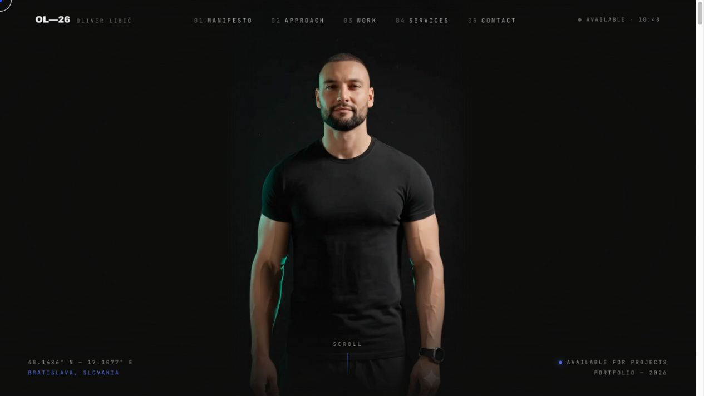

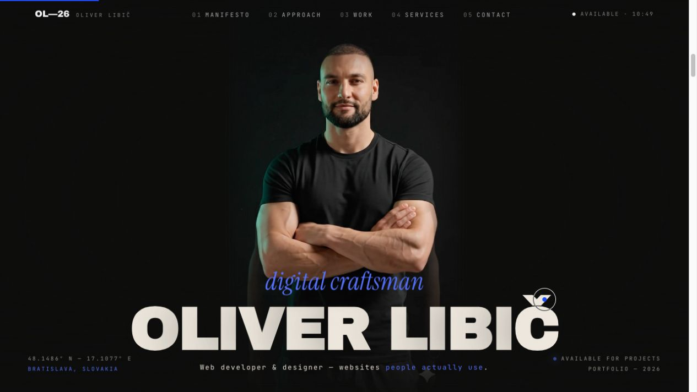

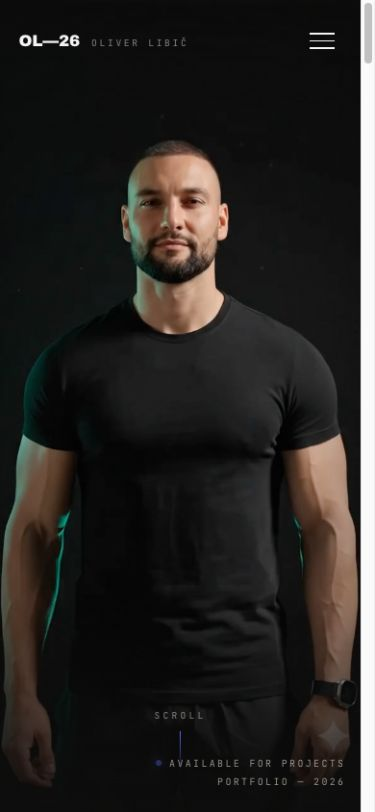

### Krok 2 — Manifesto

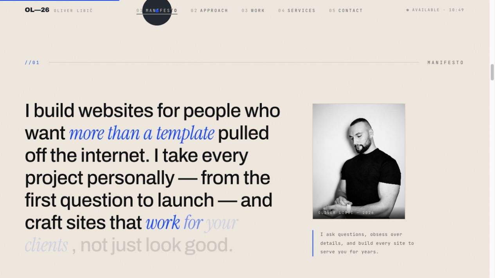

### Krok 3 — Approach

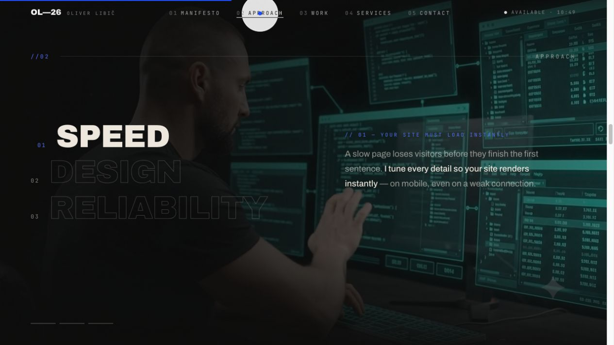

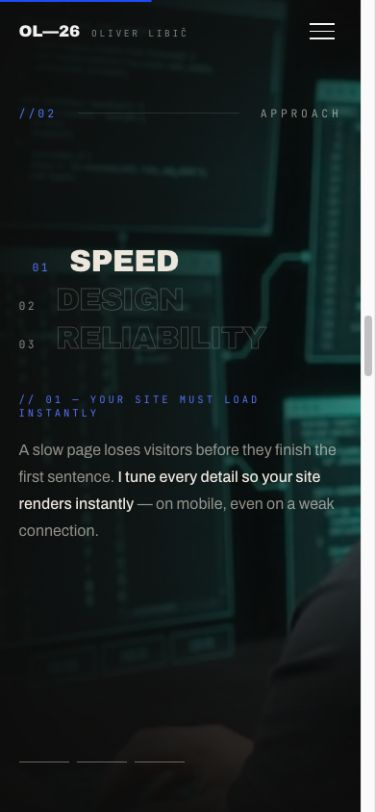

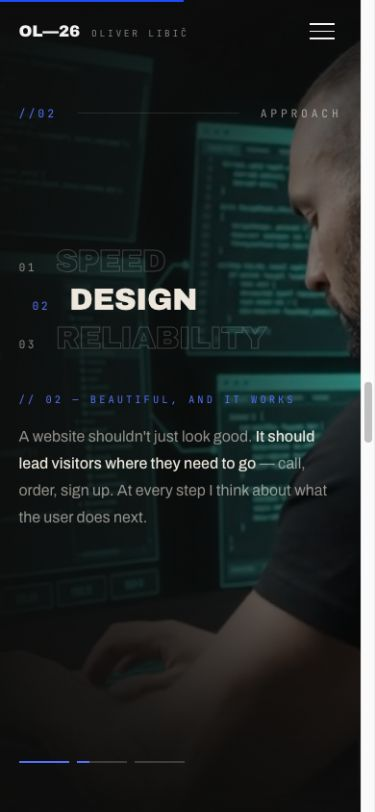

### Krok 4 — Selected Work

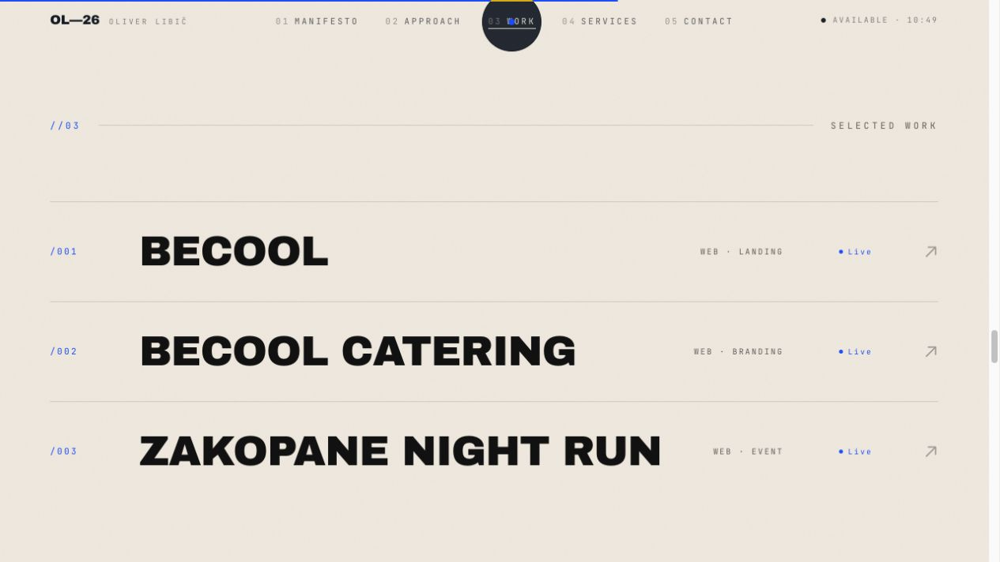

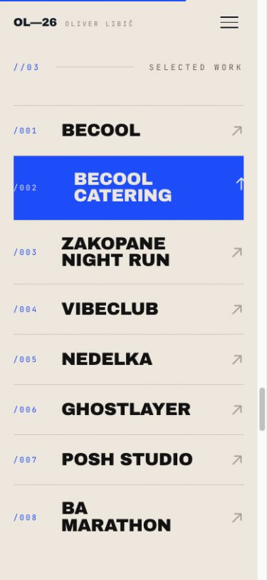

### Krok 5 — Services

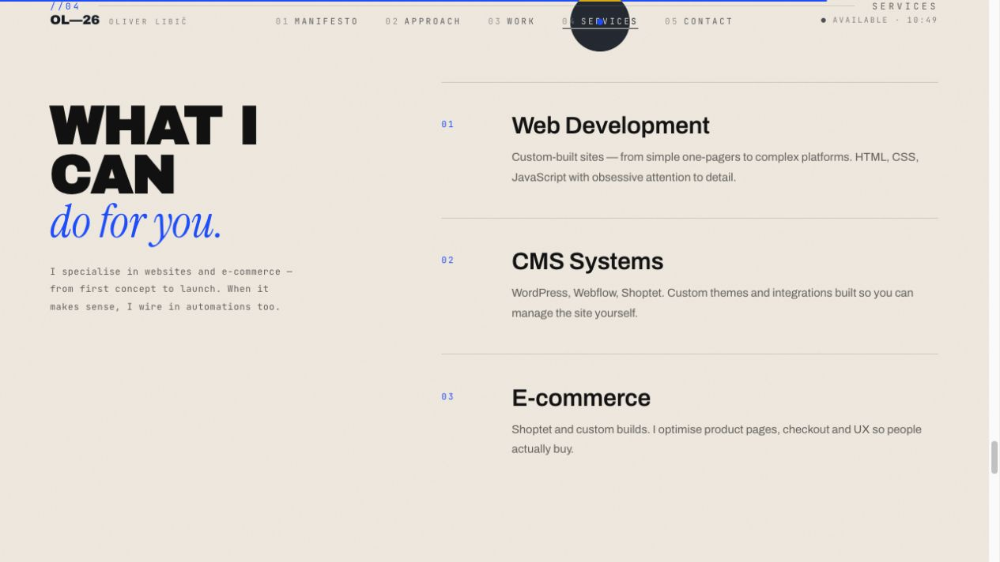

### Krok 6 — Contact

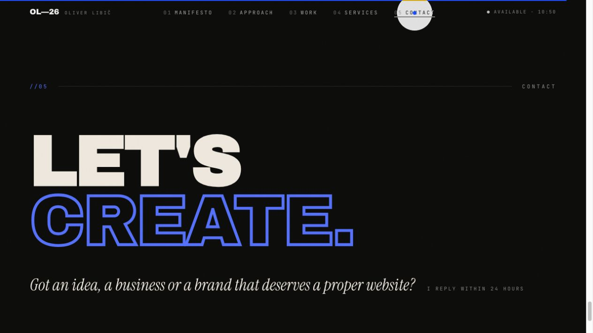

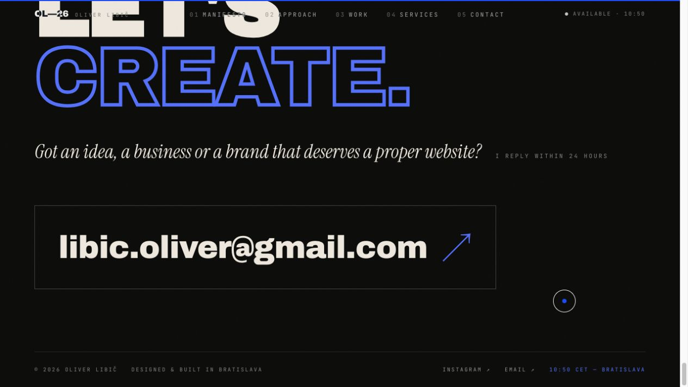

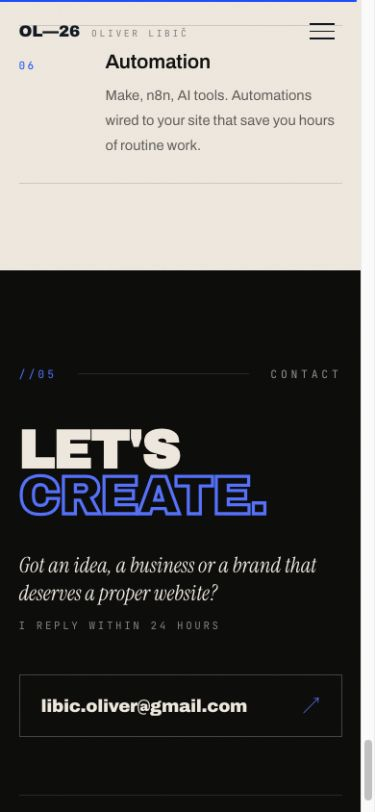

### Krok 7 — Mobilné menu

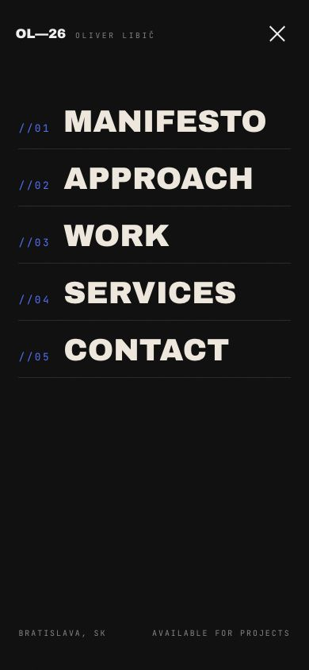
